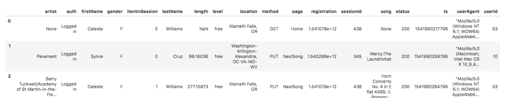

Schema for Song Play Analysis

The first dataset is a subset of real data from the Million Song Dataset. 
http://millionsongdataset.com/pages/getting-dataset/
Each file is in JSON format and contains metadata about a song and the artist of that song. 
example of each json files; {"num_songs": 1, "artist_id": "TRABCEI228F424C983", "artist_latitude": null, "artist_longitude": null, "artist_location": "", "artist_name": "Line Renaud", "song_id": "SOUPIRU12A6D4FA1E1", "title": "Der Kleine Dompfaff", "duration": 152.92036, "year": 0}

I took data from json files and created normalized database which has star schema. 

Purpose of the project make song data more understandable and make easy query and analyses the data. 

To run this files properly you need to have PostgreSQL in your computer. 

Fact Table ; 
1.songplays - records in log data associated with song plays i.e. records with page NextSong

Dimension Tables
2.users - users in the app
user_id, first_name, last_name, gender, level

3.songs - songs in music database
song_id, title, artist_id, year, duration

4.artists - artists in music database
artist_id, name, location, latitude, longitude

5.time - timestamps of records in songplays broken down into specific units
start_time, hour, day, week, month, year, weekday

Create Tables; sql_quaries.py creates each table

Test; test.ipynb to confirm the creation of your tables with the correct columns

Build ETL Processes:
 Run etl.py develop ETL processes for each table.

